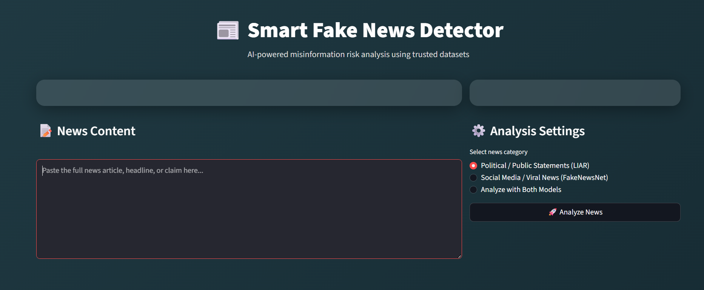
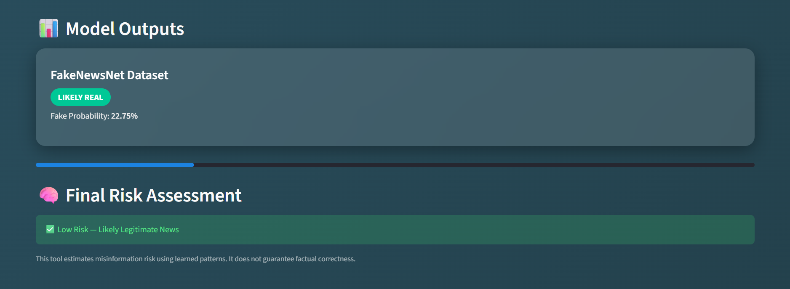

# Smart Fake News Detection

An end-to-end machine learning web application that detects fake vs. real news using NLP and domain-specific models. The system selects the best model based on news type (political statements vs. social-media/viral news) and provides an interactive Streamlit interface for real-time testing and explainability.

## Overview

Fake news spreads fast and influences public opinion; automated detection helps platforms and users flag likely misinformation for human review. This project demonstrates practical NLP, model selection, and deployment skills applied to a real-world problem.

## Key Features

- Detects fake news from free-text input.
- Domain-aware models for political statements and social-media news.
- Clear model performance metrics and comparison.
- Interactive UI with prediction outputs and explanations.
- End-to-end pipeline from preprocessing to training, evaluation, and deployment.

## Datasets

- **LIAR Dataset** — Political statements dataset used for the political-domain model.
- **FakeNewsNet Dataset** — Social-media and viral news dataset used for the social-news model.

## Models & Performance

| Dataset | Model | Primary Metric |
|---------|-------|----------------|
| LIAR (Political) | Logistic Regression, XGBoost Classifier | Accuracy ≈ 91% |
| FakeNewsNet (Social) | Logistic Regression | Accuracy ≈ 83% |

Additional metrics such as ROC-AUC, precision, recall, F1-score, and confusion matrices are available in the evaluation notebooks.

## What I Built

- Data cleaning and text normalization using NLP techniques such as tokenization, stopword removal, and lemmatization.
- Feature engineering using TF-IDF and domain-specific features.
- Model training and selection using Logistic Regression and XGBoost Classifier.
- Model serialization using joblib for deployment.
- Streamlit dashboard for interactive predictions and basic explainability.
- Deployment-ready repository with instructions and examples.

## Demo

- **Live Demo:** [Try the app](https://fake-news-detection-streamlit.onrender.com/)

## Screenshots

### Main Dashboard


### Prediction Results


## Project Structure

```text
smart-fake-news-detection/
├── app.py
├── notebooks/
├── models/
├── src/
├── assets/
├── requirements.txt
└── README.md
```

## Example Usage

- Paste a news article or short statement into the app.
- Select the appropriate news domain.
- Click **Predict** to get the prediction label and result.

## Tech Stack

- Python
- NLP
- Scikit-learn
- XGBoost
- Streamlit
- Pandas
- NumPy
- Joblib
